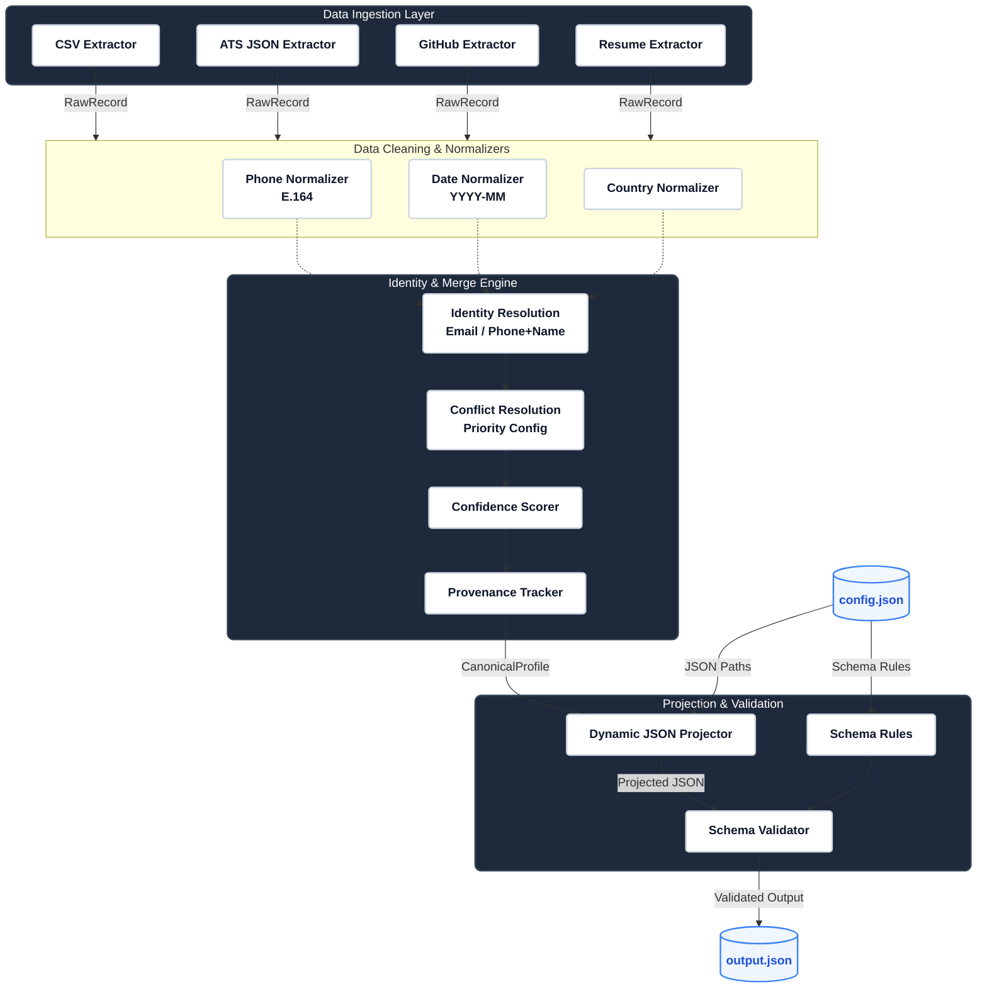

# Candidate Intelligence Engine

## Production-Grade Multi-Source Candidate Data Transformation Platform

**Built for the Eightfold AI Engineering Internship Assignment**


## Live Demo

**Streamlit Application:**  
https://preethi-candidate-engine.streamlit.app/


---

# Project Overview

The **Candidate Intelligence Engine** is a production-style AI engineering application that consolidates candidate information from multiple structured and unstructured sources into a single, validated, canonical candidate profile.

The system follows a deterministic and explainable processing pipeline that performs:

- Source Detection
- Data Extraction
- Normalization
- Canonicalization
- Entity Resolution
- Conflict Resolution
- Confidence Scoring
- Provenance Tracking
- Runtime Projection
- Pydantic Validation

The final output is a configurable JSON profile generated without modifying application code.

---

# System Architecture



---

## Architecture Components

| Component | Responsibility |
|-----------|----------------|
| **Streamlit Dashboard** | User interface for uploading files, configuring runtime settings, and visualizing results. |
| **FastAPI Backend** | Exposes REST APIs and orchestrates the complete processing pipeline. |
| **Extractors** | Parse structured (CSV, ATS JSON) and unstructured (PDF, DOCX, TXT) inputs. |
| **Normalizers** | Standardize emails, phone numbers, dates, locations, skills, and experience. |
| **Merge Engine** | Resolves duplicate entities and conflicting values using configurable source priority. |
| **Canonical Profile** | Stores the immutable, normalized candidate record with provenance metadata. |
| **Projection Layer** | Generates customized JSON outputs based on runtime YAML/JSON configuration. |
| **Validation Layer** | Validates projected output using Pydantic schemas before returning results. |
| **Streamlit Dashboard** | Displays canonical profile, projected JSON, AI insights, and validation status. |

---

# Features

## Supported Input Sources

### Structured Sources

- Recruiter CSV
- ATS JSON

### Unstructured Sources

- Resume (PDF)
- Resume (DOCX)
- Recruiter Notes (TXT)
- GitHub Profile URL (Optional)

---

## Processing Pipeline

```
Source Detection
        │
        ▼
Data Extraction
        │
        ▼
Normalization
        │
        ▼
Canonicalization
        │
        ▼
Entity Resolution
        │
        ▼
Conflict Resolution
        │
        ▼
Confidence Scoring
        │
        ▼
Provenance Tracking
        │
        ▼
Projection Layer
        │
        ▼
Pydantic Validation
        │
        ▼
Final JSON Output
```

---

## Core Capabilities

- Multi-source candidate ingestion
- Resume parsing
- Recruiter CSV processing
- ATS JSON processing
- Deterministic merge engine
- Configurable source priority
- Field normalization
- Entity resolution
- Conflict resolution
- Canonical candidate profile
- Field-level provenance tracking
- Confidence scoring
- Runtime JSON/YAML configuration
- Dynamic field mapping
- Runtime configurable projection
- Configurable output schema
- Explainable processing
- FastAPI REST API
- Interactive Streamlit dashboard

---

# Technology Stack

## Backend

- Python
- FastAPI
- Pydantic
- Pandas
- PyMuPDF
- python-docx
- YAML
- JSON

## Frontend

- Streamlit
- Plotly
- Custom CSS

## Testing

- PyTest

---

# Project Structure

```
candidate-ai-engine/
│
├── backend/
│   ├── app/
│   │   ├── canonicalizers/
│   │   ├── extractors/
│   │   ├── merge_engine/
│   │   ├── normalizers/
│   │   ├── projection/
│   │   ├── schemas/
│   │   └── main.py
│
├── frontend/
│   └── streamlit/
│       └── dashboard.py
│
├── sample_data/
├── tests/
├── requirements.txt
├── config.toml
└── README.md
```

---

# Data Processing Flow

The application processes candidate information through the following stages:

1. Detect input source
2. Extract candidate data
3. Normalize values
4. Canonicalize entities
5. Resolve duplicate entities
6. Resolve conflicting values
7. Generate canonical profile
8. Calculate confidence scores
9. Track provenance
10. Apply runtime projection
11. Validate using Pydantic
12. Generate final JSON

---

# Internal Canonical Profile

The internal canonical profile stores every extracted field in a normalized format together with provenance metadata.

Example:

```json
{
  "full_name": "Preethi S",
  "emails": [
    "prepreethi2611@gmail.com"
  ],
  "phones": [
    "+918778524631"
  ],
  "skills": [
    "Python",
    "Java",
    "FastAPI",
    "Machine Learning"
  ],
  "location": {
    "city": "Coimbatore",
    "region": "Tamil Nadu",
    "country": "IN"
  },
  "overall_confidence": 0.92,
  "field_provenance": {
    "...": "..."
  }
}
```

---

# Runtime Configurable Projection

The internal canonical profile always remains unchanged.

A runtime YAML or JSON configuration dynamically reshapes the final output without changing any application code.

Example Configuration

```yaml
fields:
  - path: candidate_full_name
    from: full_name

  - path: primary_contact_email
    from: emails[0]

  - path: verified_phone
    from: phones[0]

include_provenance: false
include_confidence: false
on_missing: omit
```

Generated Output

```json
{
  "candidate_full_name": "Preethi S",
  "primary_contact_email": "prepreethi2611@gmail.com",
  "verified_phone": "+918778524631"
}
```

---

## Dashboard Features

- Home Dashboard
- Upload & Process
- Results Dashboard
- Configuration Page
- Candidate Overview
- Internal Canonical Profile
- Projected JSON Viewer
- Processing Pipeline Visualization
- Validation Status
- Confidence Summary
- AI Insights
- JSON Download
- Light/Dark Theme Toggle

---

# AI Insights

The dashboard generates concise candidate insights including:

- Total Fields Extracted
- Candidate Quality Score
- Resume Completeness Score
- Overall Confidence Score
- Skills Extracted
- Missing Required Fields

---

# Explainability

Every selected field includes traceable metadata:

- Source
- Extraction Method
- Confidence Score
- Validation Status
- Normalization Status
- Timestamp

This ensures the pipeline is deterministic, transparent, and fully explainable.

---

# Validation

All projected outputs are validated using Pydantic.

Validation includes:

- Required fields
- Data types
- Email format
- Phone number format
- Country code validation
- JSON schema validation

---

# Edge Cases Handled

- Missing values
- Invalid emails
- Invalid phone numbers
- Duplicate skills
- Duplicate candidates
- Conflicting values
- Empty recruiter CSV rows
- Corrupted resume files
- Unsupported input formats
- Source priority conflicts

---

# Running the Project

Clone the repository

```bash
git clone https://github.com/your-username/candidate-ai-engine.git
```

Navigate into the project

```bash
cd candidate-ai-engine
```

Create a virtual environment

```bash
python -m venv venv
```

Activate the environment

Windows

```bash
venv\Scripts\activate
```

Linux / macOS

```bash
source venv/bin/activate
```

Install dependencies

```bash
pip install -r requirements.txt
```

Run the FastAPI backend

```bash
uvicorn backend.app.main:app --reload
```

Run the Streamlit frontend

```bash
streamlit run frontend/streamlit/dashboard.py
```

---

# Testing

Execute all unit tests

```bash
pytest
```

Tests cover:

- Data extraction
- Normalization
- Merge engine
- Entity resolution
- Projection layer
- Validation
- API endpoints

---

# Assignment Requirements Coverage

| Requirement | Status |
|-------------|--------|
| Structured Source | ✓ |
| Unstructured Source | ✓ |
| Source Detection | ✓ |
| Data Extraction | ✓ |
| Normalization | ✓ |
| Canonicalization | ✓ |
| Entity Resolution | ✓ |
| Conflict Resolution | ✓ |
| Confidence Scoring | ✓ |
| Provenance Tracking | ✓ |
| Runtime Projection | ✓ |
| Configurable Output | ✓ |
| Field Renaming | ✓ |
| Missing Value Handling | ✓ |
| Pydantic Validation | ✓ |
| FastAPI Backend | ✓ |
| Streamlit Frontend | ✓ |

---

# Design Principles

- Clean Architecture
- SOLID Principles
- Modular Design
- Deterministic Processing
- Explainable AI
- Configuration-Driven Development
- Scalable Pipeline
- Production-Oriented Engineering

---

# Learning Outcomes

This project demonstrates practical experience with:

- AI Engineering
- Data Engineering
- Backend API Development
- Resume Parsing
- Information Extraction
- Data Normalization
- Entity Resolution
- Explainable AI
- Runtime Configuration
- Production System Design

---

# Author

**Preethi S**

**Email:** prepreethi2611@gmail.com

**LinkedIn:** https://www.linkedin.com/in/preethi-s-945054364

**GitHub:** https://github.com/Preethi20052
